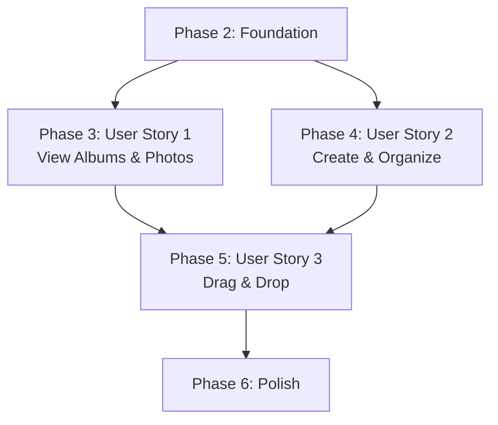

# Tasks: Photo Album Organizer

**Input**: Design documents from `/specs/001-photo-albums/`  
**Prerequisites**: plan.md, spec.md, research.md, data-model.md, contracts/, quickstart.md

**Tests**: Tests are NOT explicitly requested in the feature specification, so test tasks are excluded per SpecKit guidelines.

**Organization**: Tasks are grouped by user story to enable independent implementation and testing of each story.

## Format: `[ID] [P?] [Story] Description`

- **[P]**: Can run in parallel (different files, no dependencies)
- **[Story]**: Which user story this task belongs to (e.g., US1, US2, US3)
- Include exact file paths in descriptions

## Path Conventions

- Single-page web application: `src/`, `tests/`, `public/` at repository root
- Paths follow structure defined in plan.md

---

## Phase 1: Setup (Shared Infrastructure)

**Purpose**: Project initialization and basic structure

- [X] T001 Initialize npm project with Vite, sql.js, exifr dependencies per quickstart.md
- [X] T002 Create directory structure (src/{models,services,components,utils}, tests/{unit,integration}, public/assets)
- [X] T003 [P] Configure Vite with CORS headers for SharedArrayBuffer in vite.config.js
- [X] T004 [P] Configure ESLint and Prettier per quickstart.md in .eslintrc.js and .prettierrc
- [X] T005 [P] Create public/index.html with app container and script tag
- [X] T006 [P] Create src/style.css with base styles (grid layouts, button styles)
- [X] T007 [P] Create public/assets/placeholder-image.svg for empty album state

---

## Phase 2: Foundational (Blocking Prerequisites)

**Purpose**: Core infrastructure that MUST be complete before ANY user story can be implemented

**⚠️ CRITICAL**: No user story work can begin until this phase is complete

- [X] T008 Create Database.js model in src/models/Database.js with sql.js initialization
- [X] T009 Implement SQLite schema creation (albums, photos, album_photos tables) per data-model.md in src/models/Database.js
- [X] T010 Add database indexes (display_date, display_order, file_path, date_taken) in src/models/Database.js
- [X] T011 [P] Create Album.js model class in src/models/Album.js with validation methods
- [X] T012 [P] Create Photo.js model class in src/models/Photo.js with metadata fields
- [X] T013 Create AlbumService.js in src/services/AlbumService.js implementing createAlbum() per AlbumService contract
- [X] T014 Implement listAlbums(sortBy) method in src/services/AlbumService.js with date/manual sorting
- [X] T015 [P] Create PhotoService.js in src/services/PhotoService.js implementing extractMetadata() with exifr
- [X] T016 [P] Create FileService.js in src/services/FileService.js with File System Access API detection and fallback
- [X] T017 [P] Create ThumbnailService.js in src/services/ThumbnailService.js with Canvas API thumbnail generation
- [X] T018 Implement IndexedDB cache initialization for thumbnails in src/services/ThumbnailService.js
- [X] T019 [P] Create error handling utilities in src/utils/errorHandling.js (ValidationError, NotFoundError, DuplicateError classes)
- [X] T020 [P] Create date formatting utilities in src/utils/dateUtils.js for Unix timestamp display
- [X] T021 Initialize main application entry point in src/main.js with database initialization

**Checkpoint**: Foundation ready - user story implementation can now begin in parallel

---

## Phase 3: User Story 1 - View and Browse Photos in Albums (Priority: P1) 🎯 MVP

**Goal**: Display album list and view photos in tile grid - the core value proposition

**Independent Test**: Load sample albums with photos and verify: (1) albums display chronologically by date, (2) clicking album opens photo grid, (3) photos display as tiles, (4) smooth scrolling

### Implementation for User Story 1

- [X] T022 [P] [US1] Create AlbumList.js component in src/components/AlbumList.js to render album grid
- [X] T023 [P] [US1] Create AlbumCard.js component in src/components/AlbumCard.js displaying name, date, photo count, placeholder for empty
- [X] T024 [P] [US1] Create PhotoGrid.js component in src/components/PhotoGrid.js with tile layout and lazy loading setup
- [X] T025 [P] [US1] Create PhotoTile.js component in src/components/PhotoTile.js with thumbnail display and missing file handling
- [X] T026 [US1] Implement getAlbum(id) method in src/services/AlbumService.js per AlbumService contract
- [X] T027 [US1] Implement getAlbumPhotos(albumId) method in src/services/AlbumService.js returning photos sorted by date_taken
- [X] T028 [US1] Wire AlbumList component to fetch and display albums on app load in src/main.js
- [X] T029 [US1] Implement album click handler to navigate to album detail view in src/components/AlbumList.js
- [X] T030 [US1] Wire PhotoGrid component to load album photos when album opened in src/app.js
- [X] T031 [US1] Implement Intersection Observer for lazy loading photo thumbnails in src/components/PhotoGrid.js
- [X] T032 [US1] Add thumbnail caching retrieval in src/services/ThumbnailService.js (check IndexedDB before generating)
- [X] T033 [US1] Implement empty album placeholder display (icon + "No photos" text) in src/components/AlbumCard.js
- [X] T034 [US1] Implement missing photo file placeholder display in src/components/PhotoTile.js
- [X] T035 [US1] Add smooth scrolling styles for photo grid in src/style.css (60fps target)

**Checkpoint**: At this point, User Story 1 should be fully functional and testable independently

---

## Phase 4: User Story 2 - Create and Organize Albums (Priority: P2)

**Goal**: Enable album creation and photo addition with automatic date-based organization

**Independent Test**: Create new album, add photos with specific dates, verify album appears in correct chronological position with earliest photo's date

### Implementation for User Story 2

- [X] T036 [P] [US2] Create FilePickerDialog.js component in src/components/FilePickerDialog.js with multi-select support
- [X] T037 [US2] Implement showOpenFilePicker detection and fallback to file input in src/services/FileService.js
- [X] T038 [US2] Implement validateFile() method in src/services/PhotoService.js checking JPEG/PNG/WebP/GIF formats
- [X] T039 [US2] Implement addPhoto(file) method in src/services/PhotoService.js extracting EXIF with date fallbacks per PhotoService contract
- [X] T040 [US2] Implement addPhotos(files) batch method in src/services/PhotoService.js with transaction support
- [X] T041 [US2] Implement getPhotoByPath() method in src/services/PhotoService.js for duplicate detection
- [X] T042 [US2] Implement addPhotosToAlbum(albumId, photoIds) method in src/services/AlbumService.js per AlbumService contract
- [X] T043 [US2] Add display_date update logic (earliest photo date) in src/services/AlbumService.js after photos added
- [X] T044 [US2] Add "Create Album" button to main page in public/index.html
- [X] T045 [US2] Implement create album button click handler in src/main.js showing name prompt
- [X] T046 [US2] Call AlbumService.createAlbum(name) on user confirmation in src/main.js
- [X] T047 [US2] Show add photos prompt after album creation in src/main.js (user can skip)
- [X] T048 [US2] Wire file picker dialog to open on "Add Photos" action in src/components/FilePickerDialog.js
- [X] T049 [US2] Process selected files through PhotoService.addPhotos() in src/components/FilePickerDialog.js
- [X] T050 [US2] Call AlbumService.addPhotosToAlbum() with returned photo IDs in src/components/FilePickerDialog.js
- [X] T051 [US2] Generate thumbnails for newly added photos asynchronously in src/services/ThumbnailService.js
- [X] T052 [US2] Cache generated thumbnails in IndexedDB in src/services/ThumbnailService.js
- [X] T053 [US2] Refresh album list after album creation to show new album in chronological position
- [X] T054 [US2] Refresh photo grid after photos added to show new thumbnails
- [X] T055 [US2] Add "Add Photos" button to album detail view in src/components/PhotoGrid.js
- [X] T056 [US2] Implement duplicate photo prevention (silently skip if photo already in album) in src/services/AlbumService.js

**Checkpoint**: At this point, User Story 2 should be fully functional - users can create albums and populate them with photos

---

## Phase 5: User Story 3 - Reorganize Albums via Drag and Drop (Priority: P3)

**Goal**: Enable manual album reordering via drag-and-drop with persistence

**Independent Test**: Display multiple albums, drag one to new position, verify order saves and persists after app reload

### Implementation for User Story 3

- [X] T057 [P] [US3] Create dragDrop.js utility in src/utils/dragDrop.js with drag event helper functions
- [X] T058 [P] [US3] Install drag-drop-touch polyfill for mobile touch support (npm install drag-drop-touch)
- [X] T059 [US3] Implement reorderAlbums(albumId, newPosition) method in src/services/AlbumService.js per AlbumService contract
- [X] T060 [US3] Add draggable attribute to album cards in src/components/AlbumCard.js
- [X] T061 [US3] Implement dragstart event handler in src/components/AlbumCard.js (set dataTransfer with albumId)
- [X] T062 [US3] Implement dragover event handler on album list in src/components/AlbumList.js (prevent default, show drop target)
- [X] T063 [US3] Add visual feedback CSS for dragging state (.dragging class) in src/style.css
- [X] T064 [US3] Add drop zone highlight CSS for valid drop targets in src/style.css
- [X] T065 [US3] Implement drop event handler in src/components/AlbumList.js calculating new position
- [X] T066 [US3] Call AlbumService.reorderAlbums() on drop with new position in src/components/AlbumList.js
- [X] T067 [US3] Update album list display order after successful reorder in src/components/AlbumList.js
- [X] T068 [US3] Persist display_order changes to SQLite database in src/services/AlbumService.js
- [X] T069 [US3] Verify manual ordering persists after app reload (test with listAlbums('manual'))
- [X] T070 [US3] Handle accidental click vs drag distinction (minimum drag distance threshold) in src/utils/dragDrop.js
- [X] T071 [US3] Add cursor style changes during drag (move icon) in src/style.css
- [X] T072 [US3] Implement smooth animation for album position changes in src/style.css

**Checkpoint**: At this point, User Story 3 should be fully functional - users can manually reorganize albums with persistence

---

## Phase 6: Polish & Cross-Cutting Concerns

**Purpose**: Performance optimization, error handling, and edge case coverage

- [X] T073 Implement LRU cache eviction for thumbnails when 500MB limit reached in src/services/ThumbnailService.js
- [X] T074 Add cache size tracking and clear cache option in settings in src/services/ThumbnailService.js
- [X] T075 [P] Optimize database queries with EXPLAIN to verify index usage in src/services/AlbumService.js
- [X] T076 [P] Add loading indicators for operations >100ms per constitution in src/components/
- [X] T077 [P] Implement error toast/notification display for user-facing errors in src/utils/errorHandling.js
- [X] T078 [P] Add keyboard navigation support (arrow keys, Enter, Esc) for accessibility in src/components/
- [X] T079 [P] Add ARIA labels and roles for screen reader support in src/components/
- [X] T080 Implement virtual scrolling if performance degrades with 500 photos in src/components/PhotoGrid.js
- [X] T081 Add performance monitoring to track album load times in src/main.js
- [X] T082 Verify album list loads in <2s for 50 albums (SC-001)
- [X] T083 Verify thumbnail display in <1s for 100 photos (SC-002)
- [X] T084 Verify drag-and-drop feedback <100ms (constitution requirement)
- [X] T085 Test with large albums (1000+ photos) and implement optimizations if needed
- [X] T086 Handle photos with identical timestamps (sort by file_path as tiebreaker) in src/services/AlbumService.js
- [X] T087 Handle photos without date metadata (use file modified date) already in PhotoService.extractMetadata()
- [X] T088 Add visual indicator showing which albums contain a specific photo in src/components/PhotoTile.js
- [X] T089 Implement preference persistence (sort_mode, theme) in SQLite preferences table
- [X] T090 Add README.md with setup instructions, feature description, and screenshots

---

## Implementation Strategy

### MVP Scope (User Story 1 Only)

The minimum viable product delivers **User Story 1** alone:
- ✅ View existing albums organized by date
- ✅ Click album to view photos in tile grid
- ✅ Lazy loading for smooth scrolling
- ✅ Empty album and missing photo handling

**Why this is viable**: Users can see their organized photos immediately. While they can't yet create new albums or reorder, the core value proposition (photo viewing) is delivered.

**Time Estimate**: T001-T035 (~35 tasks, ~40 hours)

### Incremental Delivery

After MVP, add features incrementally:

1. **Phase 4 (User Story 2)**: Album creation and photo addition - enables full organizational workflow
2. **Phase 5 (User Story 3)**: Drag-and-drop reordering - enhances UX with manual control
3. **Phase 6**: Polish, performance, accessibility - production-ready quality

### Dependencies Between User Stories

**Critical Path**: Phase 1 Setup → Phase 2 Foundation → Phase 3 US1

**Parallel Opportunities**: 
- US2 can start immediately after Foundation (independent of US1)
- US3 requires both US1 and US2 (needs visible albums and photo management)

### Parallel Execution Examples

**During Phase 2 (Foundation)**:
- Developer A: Database models (T008-T012)
- Developer B: Services (T013-T018)  
- Developer C: Utilities (T019-T020)

**During Phase 3 (User Story 1)**:
- Developer A: Components (T022-T025) - all parallel
- Developer B: Service methods (T026-T027)
- Developer C: Integration (T028-T035)

**During Phase 4 (User Story 2)**:
- Developer A: File picker and UI (T036, T044-T048)
- Developer B: Photo service methods (T037-T043)
- Developer C: Integration and caching (T049-T056)

---

## Task Summary

**Total Tasks**: 90

**Breakdown by Phase**:
- Phase 1 (Setup): 7 tasks
- Phase 2 (Foundation): 14 tasks ⚠️ BLOCKING
- Phase 3 (User Story 1 - P1): 14 tasks 🎯 MVP
- Phase 4 (User Story 2 - P2): 21 tasks
- Phase 5 (User Story 3 - P3): 16 tasks
- Phase 6 (Polish): 18 tasks

**Parallel Tasks**: 35 marked with [P] (39% of total)

**Per User Story**:
- User Story 1: 14 tasks (viewing functionality)
- User Story 2: 21 tasks (creation and organization)
- User Story 3: 16 tasks (drag-and-drop reordering)

**MVP Estimate**: 35 tasks (Setup + Foundation + US1) = ~40 hours

**Full Feature Estimate**: 90 tasks = ~100-120 hours

---

## Success Criteria Verification

Each user story has clear independent test criteria:

### User Story 1 Test
1. Load app with sample albums → Albums display chronologically ✓
2. Click album → Photo grid opens with tiles ✓
3. Scroll photo grid → Smooth 60fps, lazy loading ✓
4. View empty album → Placeholder with "No photos" ✓

### User Story 2 Test
1. Click "Create Album" → Album created with name ✓
2. Add photos via file picker → Photos extracted with EXIF dates ✓
3. Check album position → Appears in correct chronological order ✓
4. Add duplicate photo → Silently prevented ✓

### User Story 3 Test
1. Drag album card → Visual feedback shows dragging state ✓
2. Drop at new position → Order updates immediately ✓
3. Reload app → Manual order persists ✓
4. Touch device → Drag works with touch events ✓

---

## Next Steps

1. **Review** this task breakdown with team
2. **Estimate** effort for each task (use MVP as baseline)
3. **Assign** tasks to developers
4. **Start with Phase 1 & 2** (foundation must complete first)
5. **Build MVP** (User Story 1) for early feedback
6. **Iterate** on User Stories 2 and 3
7. **Polish** for production release

**Reminder**: This application follows TDD principles per constitution. Write failing tests first, then implement to make them pass.
